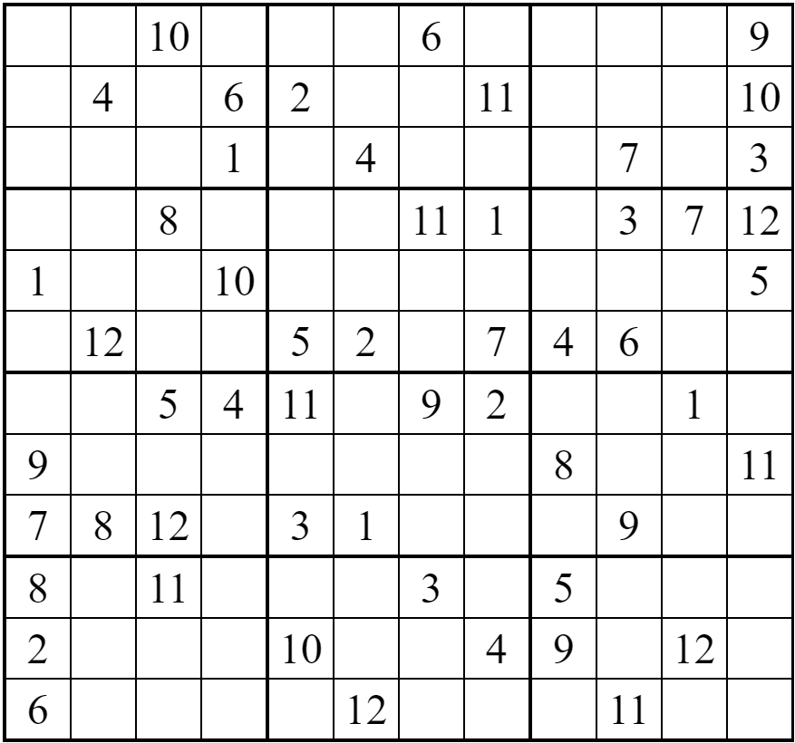
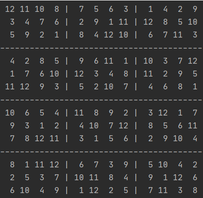

## MxN-Sudoku-Solver

Sudoku is a logic-based, combinatorial number-placement puzzle. In classic sudoku, the objective is to fill a 9×9 grid
with digits so that each column, each row, and each of the nine 3×3 sub-grids that compose the grid contain all of
the digits from 1 to 9.

Extending the idea of the classical 9×9 grid sudoku puzzle, this simple sudoku solver program written in Python can solve any valid grid size of sudoku puzzle with a sub-grid size of M×N.

To solve a sudoku, pass the sudoku as a 2D list (each element is a 1D list of each row) and its order as a tuple of length 2.

For example:

#### A 12x12 sudoku puzzle with 3x4 sub-grid size


#### Using the `main()` function

```python
order = (3, 4)  # 3 rows and 4 columns make 1 box
puzzle = [[0, 0, 10, 0, 0, 0, 6, 0, 0, 0, 0, 9],
           [0, 4, 0, 6, 2, 0, 0, 11, 0, 0, 0, 10],
           [0, 0, 0, 1, 0, 4, 0, 0, 0, 7, 0, 3],
           [0, 0, 8, 0, 0, 0, 11, 1, 0, 3, 7, 12],
           [1, 0, 0, 10, 0, 0, 0, 0, 0, 0, 0, 5],
           [0, 12, 0, 0, 5, 2, 0, 7, 4, 6, 0, 0],
           [0, 0, 5, 4, 11, 0, 9, 2, 0, 0, 1, 0],
           [9, 0, 0, 0, 0, 0, 0, 0, 8, 0, 0, 11],
           [7, 8, 12, 0, 3, 1, 0, 0, 0, 9, 0, 0],
           [8, 0, 11, 0, 0, 0, 3, 0, 5, 0, 0, 0],
           [2, 0, 0, 0, 10, 0, 0, 4, 9, 0, 12, 0],
           [6, 0, 0, 0, 0, 12, 0, 0, 0, 11, 0, 0]]
main(puzzle, order)
```
#### Solution to the puzzle
